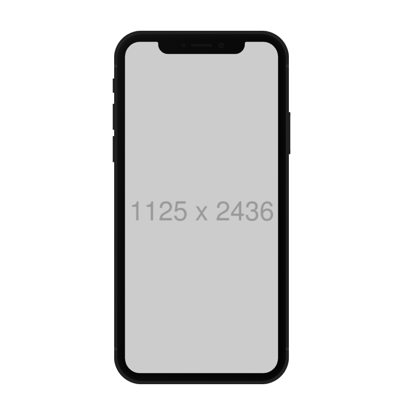
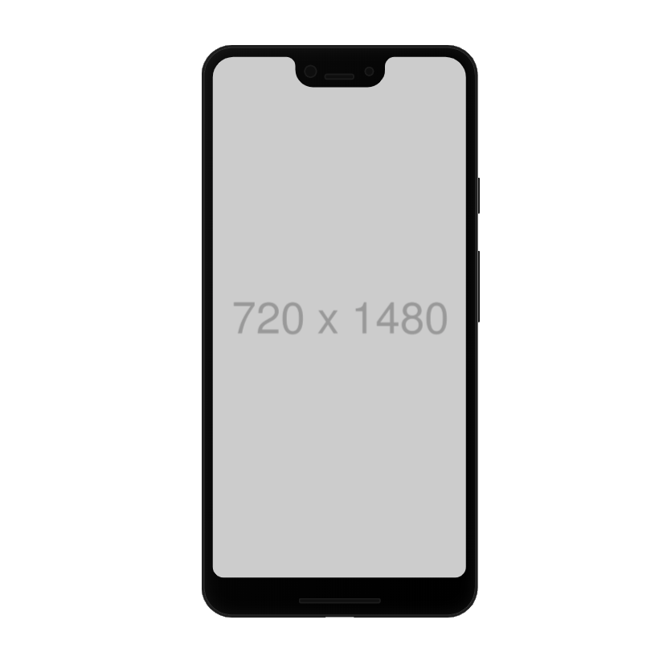
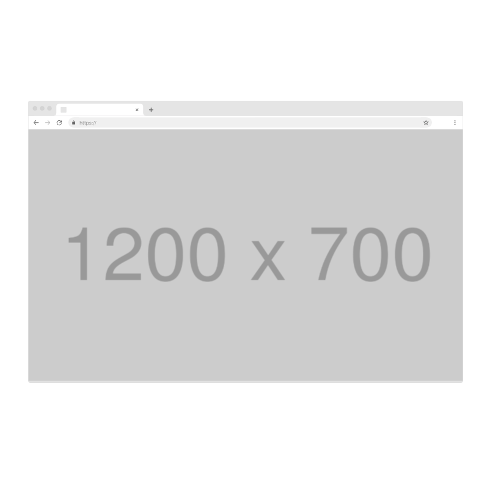

<p>
  
  <a href="https://twitter.com/hermanhasawish">
    
  </a>
</p>

> yarn add react-device-frames

[Website](https://Hermanya.github.io/react-device-frames)



```jsx
<IPhoneX screenshot={"http://placehold.jp/1125x2436.png"} />
```

## Apple iPhone X


```jsx
<IPhoneX screenshot={"http://placehold.jp/1125x2436.png"} />
```

## Google Pixel 3 XL



```jsx
<Pixel3XL screenshot={"http://placehold.jp/720x1480.png"} />
```

## Google Chrome



```jsx
<Chrome screenshot={"http://placehold.jp/1200x700.png"} />
```

Made by <a href="https://starikov.dev">Herman Starikov</a> based on <a href="https://mockups.kkuistore.com/">KK UI Store</a> design
